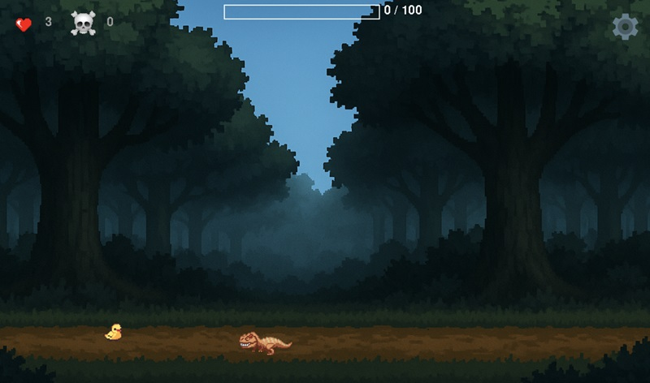

# The George game

PyGame PC Game

# Features:

- WSDA movement
- Space - jump
- Escape - pause
- Every 50 point the boss appears or a portal which you can use to move to another dimention
- Different enemies are trying to attack and kill you
- The health bar appears on top of the enemy or boss
- Enemy's health increases when dimensions are higher

# Commands:

activate .venv on MacOS: 

```bash 
source .venv/bin/activate 
```
to deactivate .venv: 

```bash
deactivate
```